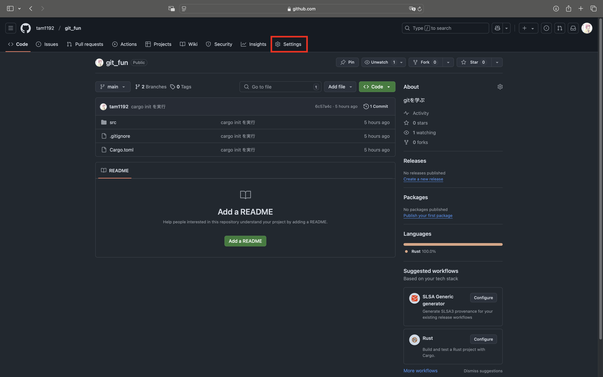
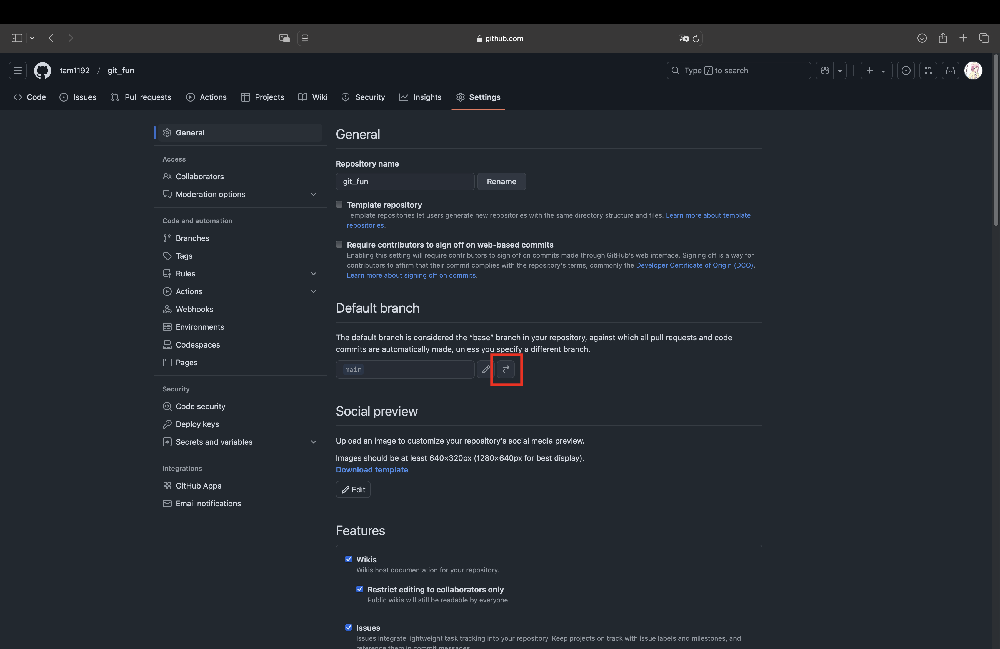
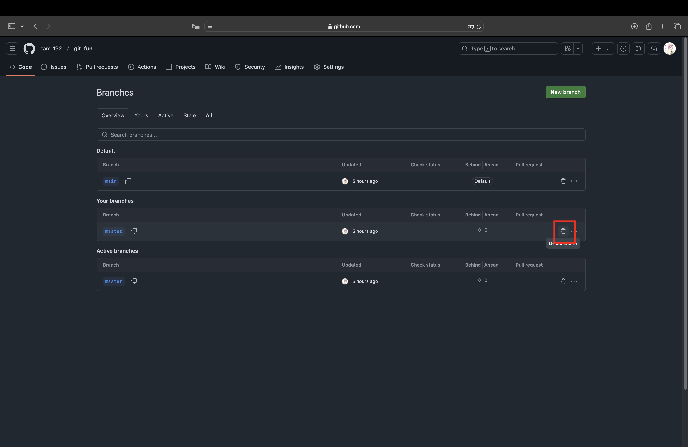
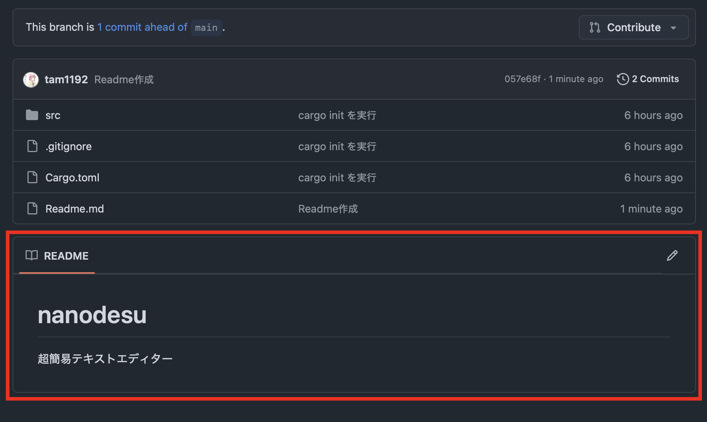

# commit: first_commit
この記事はgitを用いながらrustでプログラムを書いてみよう
っていう記事です。

> [!WARNING]  
> この記事は途中までです。

## 使ってる環境
- macOS Sequoia
- vscode
- git 2.39.5 (Apple Git-154)
- rustc 1.83.0 (90b35a623 2024-11-26)
- cargo 1.83.0 (5ffbef321 2024-10-29)
- github

## 詳しく説明しないこと
- unixのコマンド(もしくはpwsh,cmdのコマンド)

## 無駄に詳しく説明すること
- rustの知識(ある意味rust布教記事でもある)

# commit: cargo initを実行
開発環境をセットアップして、最初のコミットをしよう。

## localリポジトリをセットアップ

rustのプロジェクトを作ります。
とりあえずディレクトリを作成してそこに移動

```
cargo init .
```
を実行すると、いい感じにセットアップしてくれます。
```
.
├── Cargo.toml
└── src
    └── main.rs

```

この時点ですでに、gitのローカルリポジトリがセットアップされています。

#### 補足
cargoというのは、rust開発者を支援するツールです。
rust以外だと、cmake(c言語)、gradle(Java,Kotlin)、npm(nodejs)などがあります。

これらのツールは基本的に、外部ライブラリの整理(インストール)、ビルド支援（プログラム間の連携）をしてくれるわけです。

## githubにアクセスできるようにする

github上にリポジトリを作りましょう。

`git remote add`
する方法もあり、学びとしてはそっちの方が深いのですが、
正直こっちの方が楽

https://cli.github.com

一度githubのアカウントを作成しておけば、CLI上でログインするだけでgithubの機能をコマンド上からアクセス可能です。

**sshの鍵登録も不要！**

インストール後、
```
gh auth login --web
```
コマンドでgithubにログインします。

## githubにリポジトリを登録
一度ghコマンドを使えるようにすると、以降次の手順でgithubにリポジトリを作成可能です。

```
gh repo create 
```
対話式で様々な質問が出てきます。
```
What would you like to do? 
```
一番最初の質問で三択出てきますが
```
Push an existing local repository to GitHub
```
**(存在しているローカルリポジトリを、githubにpushする)**
を選択します。

その後はenter連打でいけます。

#### 注意
**Visibility をprivateにすると、非公開になります。** 公開するのが怖い場合は注意してください。

## コミットする
ここまできたらコミットします。

### コミットって何？
例えば、[blenderでサイコロを作る](https://blender-cg.net/dice/)とき...


上からステップごとに分かれていて、作業ステップが変わる度に
`git commmit -m <ここにコミットメッセージ>`
というコマンドを入力します。
こうすることで、ファイルをいじった時、ファイルの変更にメッセージをつけて記録しておくことができます。

### コミット頻度はどうしよう
例えば、サイコロの形に変更が入った時...


`git log`をたとって、あるコミットから分岐させることが可能になります。
（分岐の方法については後で記載します）

そう考えると、次の考え方ができます。
- コミット間に加えた変化が多いほど、戻しづらくなる
- しかし、コミットが多いほど、今度はログが見辛くなる

（例えば、サイコロの穴を開ける時、穴一つ一つ毎にコミットすれば、20コミット増えます）

しかも、`git log`した時、得られる情報はメッセージのみです。  


そう考えると、
- コミットメッセージは丁寧にした方が良い
  
となるわけです。


コミットの頻度についてはこれらの記事が参考になると思います。  
- [Git 作業における commit と push の頻度について](https://qiita.com/kozyty@github/items/87fa95a236b6142f7c10)  
- [【初心者向け】「コミットの粒度がわからない問題」の模範解答を考えてみた](https://qiita.com/jnchito/items/40e0c7d32fde352607be)  

...参考にしてるのかよく分からないですが、
今回は **「変更が一行で説明できる範囲内で１コミット」** を目標に
頑張ります。

### ところで
もちろんblenderでもgitは使えます。（blenderにターミナルついてないから相性は良くないかもだけど）
何なら、パワポ、ワード、エクセルといった3種の仁義、
その他etc...

gitのメリットの一つ **バイナリファイルが扱える** です。

(この記事も下敷きはgit使ってます)

### 実際に行ってみる
実際にコミットします。
まずはプロジェクトの一番浅いところで次のコマンドを実行
`git add .`

意味は次の章で説明

`git commit -m "cargo initを実行"`
**これでコミットができます。**
first commit? 邪道です、ちゃんとやったことを書く
（こだわり強く生きる）

## リモートにあげる
コミットしただけではリモート(github)に適用されません。

次のコマンドでリモートにアップロードできます。

まず、`git branch`を実行。

このコマンドで表示された文字列が`master`なら
`git push --set-upstream origin master`
このコマンドで表示された文字列が`main`なら
`git push --set-upstream origin main`

意味は後述

**二回目以降はこちら** 、理由は後述
`git push`

## logを確認
```
> git log
commit 6c57a4c498b7a817265563bb8e1c8b31ee1a3a7d (HEAD -> master, origin/master)
Author: nikki9750 <76221172+tam1192@users.noreply.github.com>
Date:   Sat Jan 11 17:42:06 2025 +0900

    cargo init を実行
```

commitの後ろに書いてあるハッシュみたいな文字列はコミットハッシュです。
識別子。　さっきみたいにコミット戻す時に使います。

- `HEAD`は頭。 今触っているところ。
- `master(main)`はブランチと言います。
- `origin`はリモートの名前です。　
- `Author` コミットした人
- `Date` コミットした日付

これで最初の作業は終了です。　

### ブランチ

図のように、ログを切り分けることができます。
**左から右に、ブランチを作成しています。（ブランチを切るという）**
**右から左の矢印は、切ったブランチから変更を適用しています。**

一度作成したブランチは消すまで存在し続けます。
別のブランチで加えた変更は、様々な方法で別のブランチで適用ができます。

ブランチのメリットは、触りながら理解できればいいかなと思います。

### mainとmaster(変更は任意)
masterが差別用語に該当するとかで、mainという言い方に切り替わっています。[(参考)](https://www.itmedia.co.jp/news/articles/2007/13/news057.html)

**masterブランチは、これ以降mainに統一して説明します。**

私の環境では、cargoが生成するgitリポジトリのデフォルトブランチが"master"なので、gitに触れるついでに変更しておきます。

今いるブランチをmasterにして、 
```
git branch -m main
``` 
で変更。

`-m`はブランチ名の変更を意味するそう。

そのままpushしようとすると
```
fatal: The upstream branch of your current branch does not match
the name of your current branch.  To push to the upstream branch
on the remote, use

    git push origin HEAD:master

To push to the branch of the same name on the remote, use

    git push origin HEAD

To choose either option permanently, see push.default in 'git help config'.

To avoid automatically configuring an upstream branch when its name
won't match the local branch, see option 'simple' of branch.autoSetupMerge
in 'git help config'.
```
と出るので、その通りに
```
git push origin HEAD 
```

しかし、リモート側に新規作成されるだけで、変更にはならないので...

githubのSettingsにアクセスし


Default branchを変更


その後、masterブランチを削除する

これで解決...**しない**
ローカルの方でも変更が必要。

```
> git branch -a
* main
  remotes/origin/main
  remotes/origin/master
```
`-a`オプションは、隠しブランチ的な存在を表示してくれる。
`remote`というのはその名通りリモートのこと。
リモートとローカルは、その性質上ズレが生じる。それをうまいこと解決してくれるブランチなのだが、masterが居残る。

```
git fetch --prune
```
を実行すると、masterが消えてくれる
```
> git branch -a
* main
  remotes/origin/main
  remotes/origin/master
```

試してないから知らんが、`git branch -d /remotes/origin/master`よりは安全と見た。

# branch: ライブラリを試験
日記さんはコマンドラインプログラムを書くことに決めました。

## 計画を練ろう
計画的に開発する方が、幸せになります。
（ちなみにこの記事は無計画です。）

コマンド名は`nanodesu`にします。
nanodesuは、`nano`コマンドをめっちゃシンプルにしたテキストエディターです。

大まかな計画はこんな感じ
1. 引数処理: 引数の処理をします
1. ファイル入出力処理: ファイル読み込みの処理をします
1. キー処理: コマンド実行中に受けた入力に応答します
1. 画面処理: 入力に対応して画面が動くようになります
1. デプロイ: 公開します。
1. ドキュメント作成: 説明書を作ります。

## 使うライブラリを検討
一から書くと時間がかかります。
有志が作ってくれた優秀なライブラリをフル活用しましょう。

- clap: 引数の処理をしてくれます
- ratatui: 画面の処理とキー処理を担当してくれます
- fs: ファイルの処理をしてくれます

## この先の計画を練る前に
ライブラリを使う場合、まずは触れてみたくなります。
触れるために新しいプロジェクトを作っても良いのですが、 **せっかくgitを使ってるので** 、gitで管理しようではありませんか。

## ブランチを作る

この図のように、コミットログを切り替えることができます。

**左から右に、ブランチを作成しています。（ブランチを切るという）**
```
git checkout -b <ブランチ名>
```
でブランチを切ることができます。
ここで加えた変更は、mainには適用されません。

### Readmeファイルを追加しよう
Githubでは、`Readme.md`というマークダウンファイルがある場合

この部分に、その内容が表示されます。

このファイルをブランチを使って追加してみましょう。
```
git checkout -b Readme追加
```
ブランチが作成されると
```
git branch
```
を実行した時に
```
> git branch   
* Readme追加
  main
```
となるはずです。 `*`が今作業しているブランチ。

内容は適当でいいので、Readme.mdを作成して保存。
コミットはまだしないでください。

## ブランチを切り替える
```
git checkout main
```
で一度mainに戻ります。

`ls`コマンドで中身を除くとこうなるはずです。
```
> ls                  
Cargo.toml Readme.md  src
```

ブランチをせっかく分けたのに、**変更がmainにも同時に適用されているように見えます。**

この時点で、`Readme.md`がまだ**gitの管理下にない**状態であることを理解する必要があります。 コミットもしてないから当然っちゃ当然？

### ステージング
```
git checkout Readme追加
```
で先ほどのブランチの戻ります。

`git add`は、コミットするファイルを**ステージング**するためのコマンドです。
`git add`は、前回のコミットから**変更が加えられたファイルのみを**ステージングします。
`git add .`で、カレントディレクトリーより深く変更が加えられたファイル全てをステージングに追加します。

**git addの恩恵はこの先で知ることができるはずです。**

```
git add .
```
もしくは
```
git add Readme.md
```
でステージングします。

```
git checkout main
```
でもう一度mainに戻ります。

`ls`コマンドで中身を除くとこうなるはずです。
```
> ls                  
Cargo.toml Readme.md  src
```

ステージングした時点ではまだコミット**されていません**

### コミットするブランチを決める
この状態で`git commit`をすると、mainブランチでコミットされます。
それだと困るので、
```
git checkout Readme追加
```
で先ほどのブランチの戻ります。

```
git commit -m Readme追加
```
ついでにremoteにあげましょう。

### remoteとorigin
```
git remote -v
```
を実行すると
```
> git remote -v
origin	https://github.com/tam1192/git_fun.git (fetch)
origin	https://github.com/tam1192/git_fun.git (push)
```
となるはずです。 `-v`は`verboseの略で、冗長とかいう意味があります。

originとなってますが、名前を変更できます。
```
git remote rename origin github
```
もう一度実行すると
```
git remote -v                  
github	https://github.com/tam1192/git_fun.git (fetch)
github	https://github.com/tam1192/git_fun.git (push)
```

名前が変わっています。
gitは**複数のリモートリポジトリを同時に管理可能**なため、remoteを自由に追加できます。
originとは**初期設定でつくremoteサーバーの識別名**です。

複数のremoteを使えるのは、gitが分散型だからとも言えるのではないでしょうか。
しらんけど

だけど、基本一つのremoteしか使いたくない（複雑になるから）

## リモートにブランチを作る
gitの分散というのは何も、複数のリモートを使えるということだけではありません。
リモートリポジトリの内容がローカルリポジトリに丸まるクローンされているというのも大きいです。

だからこそ、**今作ったブランチがリモートに存在するとは限らないのです**。

### git pushとは何者か
`git push`を実行すると、**ブランチごとにあらかじめ設定しておいたリモートのブランチに、変更を送信します**

### set-upstreamでリモート
実際にリモートにブランチを作るにはこう設定します
`git push --set-upstream <リモートの識別名> <リモートでのブランチ名>`
なお、基本的にローカルとリモートのブランチ名は同一です。

```
git push --set-upstream origin Readme追加
```
※`origin`を`github`に変えた場合は変更してください。

これで、リモートに変更が加えられます。

一度設定したら再び同じことをする必要はありません。
`git push`だけで送信されます。

## mainに変更を適用する
コミットが成功するとmainブランチで
```
> ls      
Cargo.toml src
```
という結果が得られるはずです。  
Readme.mdは`Readme追加`ブランチで変更を保存されたため、`main`には存在しない扱いに切り替わったのです。


gitがまだ一度もコミットしたことがない、未管理のファイルはコミットするまで全てのブランチで表示されます。  
gitがファイルを操作していないからです。  
一方で、コミットすると、コミット履歴が残っているブランチにのみファイルが存在するようになります。  
gitがファイルを操作するようになるからです。  

現時点でmainブランチにReadme.mdが作成された履歴がないから、表示されないわけです。  


# 参考URLとか
> 感想もうっすら書いてます。割と適当なので注意されたし
## 作図・図とか
- [blenderの易しい使い方 - 【Blender】サイコロを作る方法](https://blender-cg.net/dice/)
> この際だからblender触ってみたかった。　最新版でもイケる

## git
### コミット頻度関係
- [Git 作業における commit と push の頻度について](https://qiita.com/kozyty@github/items/87fa95a236b6142f7c10)
> 頻繁にコミットするのが大切らしい
- [【初心者向け】「コミットの粒度がわからない問題」の模範解答を考えてみた](https://qiita.com/jnchito/items/40e0c7d32fde352607be)
> 適度なコミットがよいらしい
- [IT Information/GitのHEADとは？HEAD~とHEAD^の違いなどを図で分かりやすく解説！](https://it-infomation.com/git-head/)
> 便利だなぁ。是非ともブックマークしたい記事

### ブランチ
- [【git】ブランチ名の変更方法(ローカル、リモート)](https://qiita.com/shungo_m/items/4218e70751375b4bfeec)
> `-n`ではなく`-m`なのか。　変更することないから知らんかった。
- [Git で「追跡ブランチ」って言うのやめましょう](https://qiita.com/uasi/items/69368c17c79e99aaddbf)
> 追跡ブランチってちょっと複雑だから使わないように気をつけて書いてた。

## rust関係
### Crate
- [Crate clap](https://docs.rs/clap/latest/clap/)
